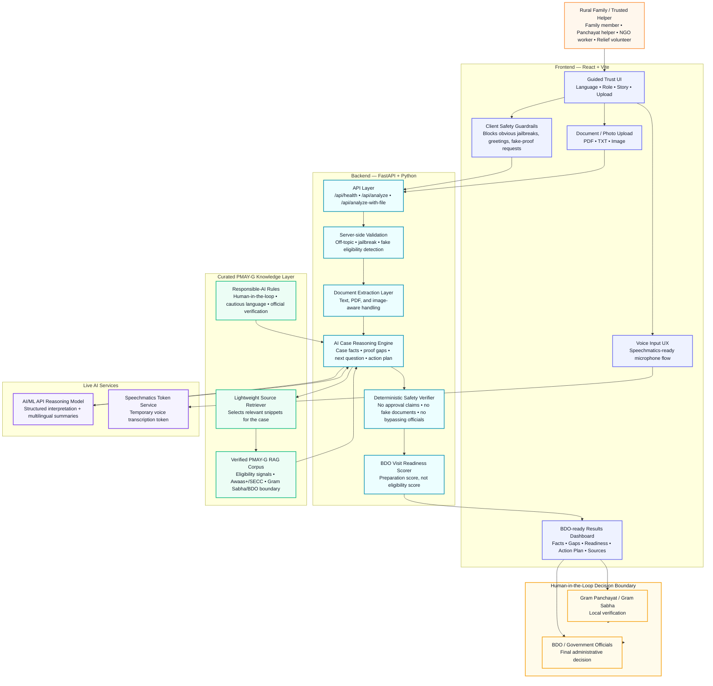
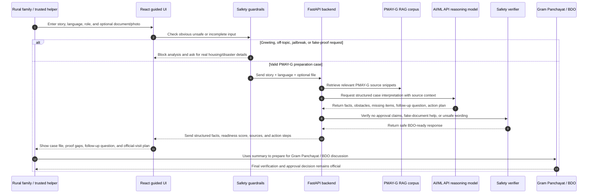

# GharDisha AI

**Trusted-helper-assisted AI case interpreter for disaster-displaced rural families navigating PMAY-G preparation.**

> **Student-built prototype. Not an official Government of India service.** GharDisha AI does **not** decide PMAY-G eligibility, approve benefits, or replace Gram Sabha / BDO verification. It prepares a family or trusted helper for the official process with safer, source-grounded guidance.

---

## 1. Project Overview

GharDisha AI helps disaster-displaced rural families explain their housing situation in simple language and receive a structured, BDO-ready preparation summary.

Instead of asking vulnerable users to understand scheme language, forms, proof requirements, and official verification steps by themselves, GharDisha AI converts a messy family story into:

- structured case facts,
- missing proof gaps,
- PMAY-G source-grounded guidance,
- targeted follow-up questions,
- a BDO / Gram Panchayat action plan,
- and a responsible AI safety boundary that avoids false approval claims.

The system is designed for a **trusted helper workflow**, where a Panchayat helper, NGO worker, relief volunteer, village representative, or family member can assist the beneficiary.

---

## 2. Problem

Rural families affected by floods, earthquakes, land cracks, storms, or displacement often do not know:

- whether their housing situation needs official verification,
- which documents or proof they should collect,
- whether their name appears in Awaas+ / SECC-related lists,
- what to ask the Gram Panchayat or BDO office,
- how to avoid relying on rumours or unsafe advice.

A normal chatbot may overclaim eligibility or give generic advice. GharDisha AI is different: it is built around **case preparation**, not approval.

---

## 3. Core Idea

```text
Messy family story
        ↓
AI case fact extraction
        ↓
PMAY-G source retrieval
        ↓
Missing proof detection
        ↓
Targeted follow-up question
        ↓
BDO-ready preparation summary
        ↓
Human verification by Gram Sabha / BDO
```

The product goal is simple:

> Help a disaster-displaced family walk into a Gram Panchayat / BDO conversation with clearer facts, better questions, and safer expectations.

---

## 4. Who It Is For

GharDisha AI is designed for:

- disaster-affected rural families,
- Panchayat / village representatives,
- NGO and aid workers,
- relief volunteers,
- community helpers,
- student/public-service innovation teams studying AI for public benefit.

---

## 5. What GharDisha AI Does

### Case Understanding

The system extracts key facts from the user story:

- disaster displacement status,
- current shelter situation,
- rural context,
- whether the family owns a pucca house,
- Awaas+ / SECC uncertainty,
- available documents,
- biggest obstacle,
- missing or uncertain items.

### Source-Grounded Action Planning

It retrieves relevant PMAY-G knowledge snippets from a curated source library and generates:

- a 48-hour action plan,
- questions to ask BDO / Panchayat,
- a responsible summary for official discussion,
- source cards explaining what information was used.

### Follow-Up Readiness Loop

The system asks targeted follow-up questions when important information is missing. It limits follow-ups so the user is not trapped in an endless chat loop.

### BDO Visit Readiness Score

The readiness score is **not an eligibility score**. It only estimates how prepared the case is for official verification.

---

## 6. What GharDisha AI Does Not Do

GharDisha AI intentionally does **not**:

- say “you are eligible,”
- guarantee approval,
- generate fake documents,
- bypass official verification,
- replace Gram Sabha, BDO, or government decision-making,
- use Government of India logos or imply official affiliation.

---

## 7. System Architecture



### Architecture Principles

- **Assisted-access first:** the system is designed for a trusted helper supporting a rural family, not only for direct self-service.
- **AI prepares, humans decide:** GharDisha AI organizes facts and questions, while Gram Sabha / BDO verification remains final.
- **Grounded guidance:** PMAY-G guidance is retrieved from a curated source layer instead of relying on open-ended, unsupported generation.
- **Safety by design:** both frontend and backend guard against jailbreaks, fake documents, approval claims, and off-topic input.
- **Preparation score only:** the readiness score measures how prepared the case is for an official visit; it is not an eligibility score.

---

## 8. Architecture Components

### Frontend

**React + Vite** frontend with:

- guided trust onboarding,
- multilingual UI,
- voice-ready interaction,
- story input,
- document/photo upload,
- demo starter chips,
- readiness visualization,
- source cards,
- follow-up question flow,
- safety and non-official-service messaging.

### Backend

**FastAPI** backend with:

- `/api/health` for live system status,
- `/api/analyze` for story-based analysis,
- `/api/analyze-with-file` for story plus document/photo analysis,
- `/api/speechmatics-token` for temporary voice transcription tokens.

### AI Reasoning Layer

The reasoning layer uses AI/ML API for:

- extracting structured case facts,
- interpreting uploaded documents or images where applicable,
- producing source-grounded action plans,
- generating safe, multilingual, user-facing summaries.

### RAG Source Layer

The PMAY-G knowledge base is a curated grounding layer. It is not mock output. It helps the AI stay focused on official scheme-preparation guidance instead of inventing unsupported claims.

### Safety Layer

A deterministic safety verifier prevents unsafe wording such as:

- guaranteed eligibility,
- approval claims,
- fake-document requests,
- jailbreak attempts,
- bypassing official verification.

---

## 9. AI Case Interpretation Flow



### Workflow Summary

1. The family or helper tells a messy housing/disaster story in natural language.
2. The frontend blocks obvious unsafe input before calling the backend.
3. The backend validates the request, extracts documents when provided, and retrieves PMAY-G source snippets.
4. The AI reasoning layer produces structured case facts, missing proof gaps, a next-best follow-up question, and a BDO-ready action plan.
5. A deterministic safety verifier checks that the answer does not claim eligibility, guarantee approval, or bypass official verification.
6. The frontend displays the final safe output: case facts, biggest obstacle, readiness score, source cards, follow-up question, and official-visit summary.

---

## 10. Responsible AI Design

GharDisha AI follows a human-in-the-loop design:

- AI prepares the case.
- Officials verify the case.
- Final decisions remain with Gram Sabha / BDO / official government processes.

The system uses cautious language such as:

- “may need verification,”
- “ask the Gram Panchayat / BDO,”
- “official records must confirm,”
- “this does not decide eligibility.”

This makes the system safer for public-service use and more realistic for high-stakes benefit navigation.

---

## 11. Key Features

- Guided onboarding for trust-building.
- Multilingual interface support.
- Voice input support through Speechmatics.
- Story-to-case-file AI extraction.
- Optional document/photo upload.
- Curated PMAY-G RAG grounding.
- Follow-up question loop with limit.
- BDO visit readiness scoring.
- Source cards for transparency.
- Jailbreak and fake-eligibility blocking.
- Safety boundary: no approval claims.

---

## 12. Tech Stack

### Frontend

- React
- Vite
- JavaScript / JSX
- CSS
- Lucide React icons
- Speechmatics voice input integration

### Backend

- Python
- FastAPI
- Pydantic
- HTTPX
- Uvicorn
- AI/ML API
- Curated JSON knowledge base for PMAY-G RAG

---

## 13. Repository Structure

```text
ghardisha-ai/
├── backend/
│   ├── app/
│   │   ├── main.py              # FastAPI routes and request handling
│   │   ├── reasoning.py         # AI reasoning, prompts, safety verifier
│   │   ├── kb.py                # PMAY-G knowledge retrieval
│   │   └── speech.py            # Speechmatics token handling
│   ├── pmayg_knowledge_base.json
│   ├── requirements.txt
│   └── .env.example
│
├── frontend/
│   ├── src/
│   │   ├── main.jsx             # React UI and interaction flow
│   │   ├── styles.css           # Complete visual design
│   │   ├── translations.js      # UI translation strings
│   │   └── useVoiceInput.js     # Voice input hook
│   ├── package.json
│   ├── package-lock.json
│   ├── index.html
│   └── vite.config.js
│
├── README.md                 # Main judge-facing documentation and setup guide
├── architecture.md           # Technical architecture summary
├── FIXES_APPLIED.md          # Optional development notes, if kept
└── .gitignore
```

---

## 14. Local Setup

The setup instructions are intentionally kept inside this README so judges and reviewers do not need to open a separate setup file.

### Prerequisites

Install:

- Node.js LTS
- Python 3.11+
- Git
- VS Code or Cursor

---

### Backend Setup

```bash
cd backend
python -m venv .venv
```

Activate the virtual environment:

```bash
# Windows PowerShell
.venv\Scripts\Activate.ps1

# Windows CMD
.venv\Scripts\activate

# macOS / Linux
source .venv/bin/activate
```

Install dependencies:

```bash
pip install -r requirements.txt
```

Create a `.env` file from the example:

```bash
cp .env.example .env
```

Add your keys in `backend/.env`:

```env
AIMLAPI_KEY=your_aimlapi_key_here
AIMLAPI_BASE_URL=https://api.aimlapi.com/v1
AIMLAPI_MODEL=gpt-4o-mini
AIMLAPI_VISION_MODEL=gpt-4o-mini
SPEECHMATICS_API_KEY=your_speechmatics_key_here
```

Run the backend:

```bash
uvicorn app.main:app --reload --host 127.0.0.1 --port 8000
```

Backend health check:

```text
http://127.0.0.1:8000/api/health
```

---

### Frontend Setup

Open a second terminal:

```bash
cd frontend
npm install
npm run dev
```

Open the app:

```text
http://localhost:5173
```

---

## 15. Environment Variables

### Backend

| Variable | Required | Purpose |
|---|---:|---|
| `AIMLAPI_KEY` | Yes | Live AI reasoning and optional vision analysis |
| `AIMLAPI_BASE_URL` | Yes | AI/ML API base URL |
| `AIMLAPI_MODEL` | Yes | Text reasoning model |
| `AIMLAPI_VISION_MODEL` | Yes | Image/document interpretation model |
| `SPEECHMATICS_API_KEY` | Optional | Voice transcription support |

### Frontend

| Variable | Required | Purpose |
|---|---:|---|
| `VITE_API_URL` | Optional | Backend API base URL. Defaults to `http://localhost:8000` |

### Deployment Notes: Render + Vercel

Recommended hackathon deployment split:

```text
Backend FastAPI → Render
Frontend Vite React → Vercel
```

Render backend settings:

```text
Root Directory: backend
Build Command: pip install -r requirements.txt
Start Command: uvicorn app.main:app --host 0.0.0.0 --port $PORT
```

Vercel frontend settings:

```text
Root Directory: frontend
Build Command: npm run build
Output Directory: dist
```

Set the deployed backend URL in Vercel:

```env
VITE_API_URL=https://your-render-backend-url.onrender.com
```

Do not commit `.env`, `.env.local`, API keys, `node_modules`, or `.venv`. Store production keys only in Render / Vercel environment variables.

---

## 16. API Endpoints

| Endpoint | Method | Purpose |
|---|---|---|
| `/api/health` | `GET` | Check strict live backend status |
| `/api/analyze` | `POST` | Analyze a family story |
| `/api/analyze-with-file` | `POST` | Analyze story plus uploaded document/photo |
| `/api/speechmatics-token` | `GET` | Mint temporary token for voice transcription |

---

## 17. Demo Flow for Judges

Recommended demo path:

1. Open GharDisha AI.
2. Select a language.
3. Enter a rural disaster-displacement story.
4. Show extracted case facts.
5. Show the biggest obstacle.
6. Answer the follow-up question.
7. Show readiness score update.
8. Show BDO questions and 48-hour action plan.
9. Show source cards.
10. Test a fake approval or jailbreak prompt to show safety blocking.

Suggested story:

```text
My name is Rahul. I live near Joshimath in Chamoli district, Uttarakhand. Last month, an earthquake and land cracks damaged our kutcha house. The walls have deep cracks and the roof is unsafe, so my family is staying in a temporary shelter near the village school. We do not own any other pucca house. We have Aadhaar card, ration card, and a bank account, but our land papers are old and partly damaged. We do not know if our family name is on the Awaas+ or SECC list.
```

Expected system behavior:

- It should not say Rahul is eligible.
- It should identify missing proof and Awaas+ / SECC uncertainty.
- It should ask for damage proof or Panchayat confirmation.
- It should prepare Rahul for official verification.

---

## 18. Why This Is AI-First

GharDisha AI is not a static FAQ page. AI is necessary because real families do not describe their cases in clean form fields.

The system uses AI to:

- understand messy, multilingual stories,
- detect missing facts,
- interpret optional documents,
- retrieve relevant PMAY-G source snippets,
- generate a personalized action plan,
- ask a targeted follow-up question,
- produce a safe official-visit summary.

---

## 19. Judging Highlights

### Public Service Impact

Helps disaster-displaced rural families and helpers prepare for official housing-support verification.

### Innovation

Transforms messy human stories into structured, source-grounded case preparation.

### Responsible AI

Avoids eligibility overclaims and keeps final decisions with officials.

### Technical Depth

Combines React, FastAPI, live AI reasoning, RAG, optional document interpretation, voice input, safety verification, and multilingual UX.

### Demo Strength

The system shows a clear before-and-after: confused story → structured BDO-ready preparation.

---

## 20. Security Notes

Do not commit real secrets.

The repository should not include:

- `backend/.env`,
- `frontend/.env`,
- API keys,
- `.venv`,
- `node_modules`,
- build outputs.

Use `.env.example` for safe configuration examples.

---

## 21. Current Limitations

- This is a hackathon prototype, not a government deployment.
- The knowledge base should be reviewed and expanded before real-world use.
- Voice support depends on Speechmatics configuration and browser microphone permissions.
- Scanned PDFs may require image upload or better OCR handling.
- PMAY-G policy interpretation should be verified with official sources before production use.

---

## 22. Future Roadmap

- Add more Indian languages.
- Add offline-first assisted-access mode.
- Add Panchayat worker dashboard.
- Add stronger document OCR for scanned certificates.
- Add exportable BDO visit summary PDF.
- Add audit logs for responsible AI review.
- Add production monitoring, custom domain, and stronger deployment observability.

---

## 23. Disclaimer

GharDisha AI is a student-built public-service AI prototype. It is not affiliated with, endorsed by, or operated by the Government of India. It does not decide PMAY-G eligibility or approval. Final decisions remain with official government verification processes, including Gram Sabha / BDO review where applicable.